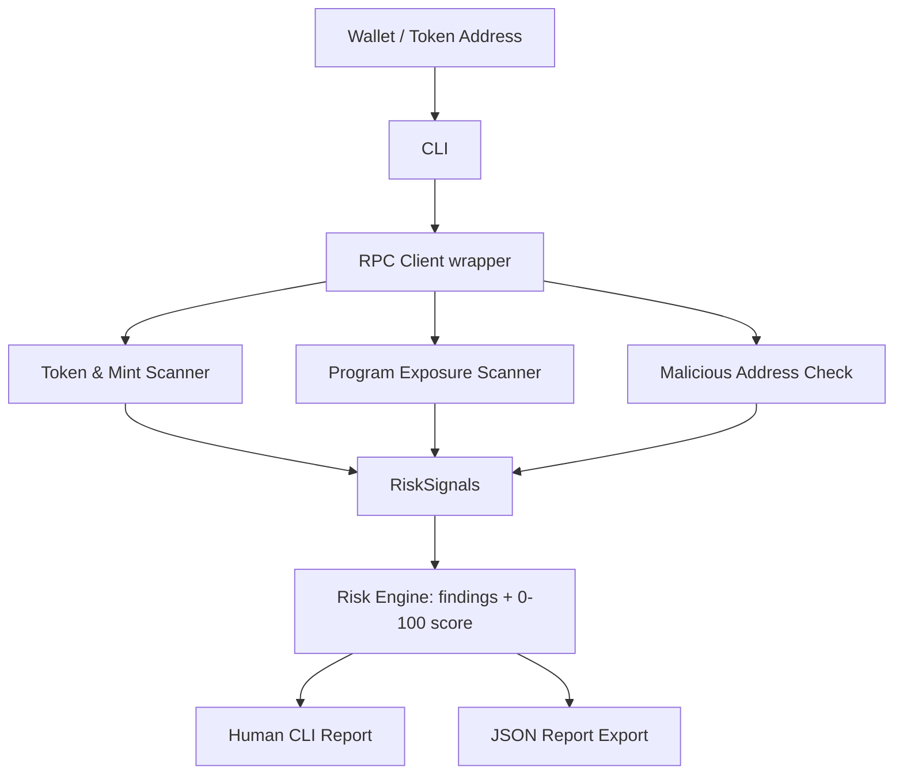
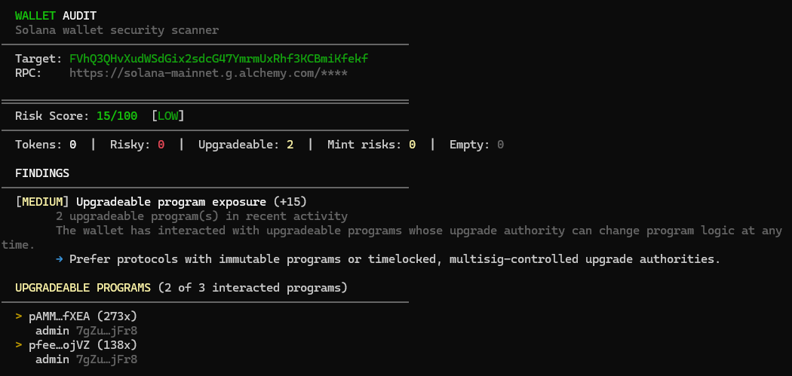

# Solana Security Audit


[](LICENSE)

A Rust CLI for scanning Solana wallets, token accounts, and program exposure for security risks. It detects risky delegates, freeze and mint authorities, non-owner close authorities, known malicious address interactions, and upgradeable program exposure, then produces a 0–100 risk score and a JSON report.

## Why wallet security matters on Solana

Most Solana losses don't come from breaking cryptography — they come from authority and approval mechanics that are easy to overlook:

- A token account can carry an **active delegate** that moves your tokens without another signature — the standard drain vector after a malicious approval.
- A mint can keep a **freeze authority** that locks your balance, or a **mint authority** that dilutes it.
- A token account's **close authority** can be set to a third party that reclaims the account.
- Programs you interact with can be **upgradeable**, so their logic can change after you've trusted them.
- Funds can flow to or be delegated to **addresses tied to known exploits**.

These are observable on-chain. This tool reads that state directly from RPC and turns it into a single, explainable risk score.

## Features

- Wallet risk scan across SPL Token and Token-2022 accounts
- Token account scan: delegate and close-authority detection
- Mint authority and freeze authority detection
- Upgradeable program exposure from recent transaction history
- Known malicious / exploit address cross-referencing
- Recently deployed program detection
- Single-token scan with holder-concentration check
- 0–100 risk score with per-finding severity, explanation, and recommendation
- JSON report export and a colored, human-readable CLI report
- Batched RPC calls (`getMultipleAccounts`) to keep large wallets fast
- Typed error handling for RPC timeouts and failures

## Risks it detects

| Category | Severity | Weight | What it means |
|---|---|---|---|
| Known malicious address | Critical | 25 | A linked address matches a known exploit/scam address |
| Active freeze authority | High | 20 | A held mint can freeze your token accounts |
| Active mint authority | High | 20 | A held mint can inflate supply |
| Active token delegate | High | 15 | A third party can move your tokens without approval |
| Upgradeable program exposure | Medium | 15 | Program logic you rely on can change |
| Suspicious holder concentration | Medium | 15 | One holder controls a large share of supply (token scan) |
| Non-owner close authority | Medium | 10 | A third party can close your token account |
| Recently deployed program | Low | 10 | Interacted with a freshly deployed, low-track-record program |

## Risk scoring methodology

The scoring engine is intentionally simple and deterministic so it stays explainable and testable:

1. The scan layer reduces on-chain state to a set of boolean/count **signals** (`RiskSignals`).
2. Each present signal produces exactly one **finding** with a fixed weight, severity, explanation, and recommendation.
3. The score is the sum of finding weights, **deduplicated by category** (the same category never stacks), **clamped to 100**.
4. The aggregate score maps to a risk level:

   | Score | Level |
   |---|---|
   | 0–9 | Minimal |
   | 10–29 | Low |
   | 30–59 | Medium |
   | 60–84 | High |
   | 85–100 | Critical |

Because the engine consumes signals rather than RPC, the entire scoring model is unit tested without a network (see `tests/risk_scoring_tests.rs`).

## Architecture



Module layout:

```
src/
  main.rs              CLI entry point
  cli.rs               argument parsing and run logic
  config.rs            runtime config and address validation
  errors.rs            typed error enum
  rpc/client.rs        RPC wrapper (timeouts, batching, error mapping)
  scanner/
    wallet.rs          full-wallet scan orchestration -> RiskSignals
    token.rs           token account + mint + single-mint scanning
    program.rs         program exposure + recency detection
    malicious.rs       known-bad address database and matcher
  risk/
    mod.rs             Severity, RiskLevel, RiskSignals, RiskFinding, RiskReport
    rules.rs           per-category weights, severities, and text
    scoring.rs         build_findings / calculate_risk_score / generate_report
  report/json.rs       JSON serialization
  display.rs           colored terminal output
```

## Installation

Requires a Rust toolchain (stable, 1.79+ recommended) and a C linker.

```bash
git clone https://github.com/thejvks/Solana-security-audit
cd Solana-security-audit
cargo build --release
# binary at ./target/release/wallet-audit
```

Public RPC endpoints are heavily rate limited and disable some methods (e.g. `getProgramAccounts`). Use a dedicated endpoint with `--rpc` for real scans.

## Usage

```bash
# Scan a wallet using the default public RPC
cargo run -- scan <WALLET_ADDRESS>

# Print the JSON report instead of the human-readable output
cargo run -- scan <WALLET_ADDRESS> --json

# Use a custom RPC endpoint
cargo run -- scan <WALLET_ADDRESS> --rpc <RPC_URL>

# Write the JSON report to a file
cargo run -- scan <WALLET_ADDRESS> --output report.json

# Scan a single token mint
cargo run -- token <TOKEN_MINT>
```

With the release binary, replace `cargo run --` with `wallet-audit`.

## CLI examples

A token scan of USDC (which keeps both a freeze and a mint authority):

```
$ wallet-audit token EPjFWdd5AufqSSqeM2qN1xzybapC8G4wEGGkZwyTDt1v

  Risk Score: 40/100  [MEDIUM]
  Mint:     EPjFWdd5AufqSSqeM2qN1xzybapC8G4wEGGkZwyTDt1v
  Decimals: 6
  Freeze:   7dGb…Crar
  Mint:     BJE5…5ruG

  FINDINGS
  [HIGH] Active freeze authority (+20)
        ...
  [HIGH] Active mint authority (+20)
        ...
```

A full high-risk wallet scan is shown in [`examples/sample-cli-output.txt`](examples/sample-cli-output.txt).

## JSON report example

```json
{
  "target": "9xQeWvG816bUx9EPjHmaT23yvVM2ZWbrrpZb9PusVFin",
  "target_type": "wallet",
  "score": 100,
  "level": "critical",
  "findings": [
    {
      "category": "malicious_address",
      "label": "Known malicious address interaction",
      "severity": "critical",
      "weight": 25,
      "explanation": "An address linked to this wallet (delegate, close authority, or program authority) matches a known exploit or scam address.",
      "recommendation": "Revoke any approvals to the flagged address immediately and move remaining funds to a fresh wallet.",
      "detail": "1 known malicious address match(es)"
    }
  ],
  "generated_at": "2026-06-06T09:16:03Z"
}
```

Full fixtures: [`examples/sample-low-risk-report.json`](examples/sample-low-risk-report.json) and [`examples/sample-high-risk-report.json`](examples/sample-high-risk-report.json). Regenerate them from the engine with `cargo run --example generate_reports`.

## Screenshots

Screenshots live in [`assets/screenshots/`](assets/screenshots). Suggested captures (add them and reference here):

- `terminal-scan.png` — a full `wallet-audit scan` run with findings
- `json-report.png` — a `--json` report or a saved `report.json`
- `risk-score.png` — the score header and findings block
- `ci-passing.png` — the GitHub Actions run, all checks green

To embed one once added:

```markdown

```

The architecture diagram renders directly from the Mermaid block above on GitHub.

## Testing

```bash
cargo test --all
```

Covered:

- clean wallet scores 0
- high-risk wallet score clamps to 100
- each signal (freeze, mint, delegate, close, malicious, upgradeable, holder concentration) raises the score
- duplicate categories do not double count
- risk-level thresholds
- every finding carries label, severity, explanation, and recommendation
- JSON report serialization round-trips
- invalid address input is rejected with a typed error
- RPC failure surfaces as a typed error (tested against a refused loopback port, no network)

## Continuous integration


[`.github/workflows/rust.yml`](.github/workflows/rust.yml) runs on every push and PR:

```bash
cargo fmt --all -- --check
cargo clippy --all-targets --all-features -- -D warnings
cargo test --all
cargo build --release
```

## Limitations

- The malicious-address database is a small static, curated list — illustrative, not exhaustive.
- Program exposure is derived from the last 50 transactions, so older interactions are not covered.
- Holder-concentration uses `getTokenLargestAccounts` (top 20) and is currently wired into the `token` scan, not the wallet scan.
- Token-2022 accounts are parsed at the base layout; extension-specific risks (e.g. transfer hooks, permanent delegate) are not yet decoded.
- Decimals/balances depend on mint accounts being resolvable; unresolved mints fall back to 0 decimals.
- No on-chain price data, so balances are token-denominated, not USD.

## What's missing before calling it production-grade

- RPC retries with backoff
- Broader RPC batching (signatures/transactions are still sequential)
- Local caching of mint/program metadata
- Rate-limit protection / endpoint failover
- A maintained malicious-address threat feed instead of a static list
- Full Token-2022 extension decoding
- Integration tests against a stable/mock RPC
- Config file support in addition to flags
- Docker image and published release binaries
- An independent review of the detection rules and weights

## Roadmap

- [ ] Retry + backoff and endpoint failover in the RPC layer
- [ ] Pluggable malicious-address feed
- [ ] Holder concentration in the wallet scan path
- [ ] Token-2022 extension risk decoding
- [ ] Mock-RPC integration tests
- [ ] Docker image and GitHub release binaries
- [ ] Optional config file

## Resume bullets

- Built a Rust-based Solana wallet security scanner that detects risky delegates, mint/freeze authorities, non-owner close authorities, upgradeable program exposure, and known malicious address interactions.
- Designed a deterministic 0–100 risk scoring engine with JSON report generation, colored CLI output, and unit tests for clean wallets, capped high-risk wallets, invalid input, and duplicate-risk handling.
- Added GitHub Actions CI (fmt, clippy with `-D warnings`, tests, release build) and a library/binary split so the scoring core is tested independently of RPC.

## License

MIT — see [LICENSE](LICENSE).
